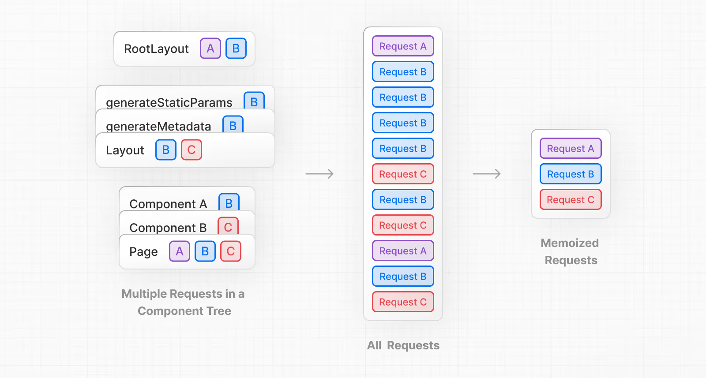
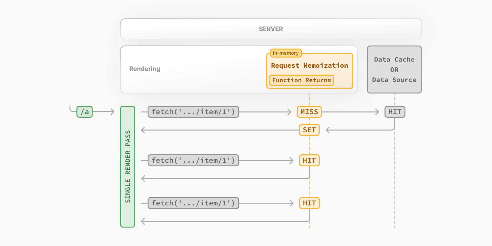
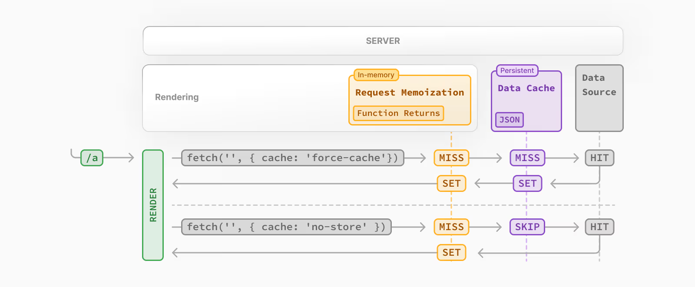

# NextJS - Understanding & Configuring Caching

## Phần 1: Request Memoization

### Tổng quan

**Request Memoization** là một cơ chế tích hợp sẵn trong Next.js giúp tránh việc gửi các request trùng lặp đến cùng một nguồn dữ liệu. Cơ chế này hoạt động tự động và bạn không cần cấu hình gì thêm.



### Cách hoạt động

Khi bạn có nhiều component hoặc layout trong Next.js cùng gửi request với **cùng một cấu hình** (cùng URL, cùng options), Next.js sẽ:

1. Chỉ gửi **một request duy nhất** đến server
2. **Tái sử dụng response** đó cho tất cả các nơi cần dữ liệu
3. Tránh việc gửi nhiều request không cần thiết



### Điều kiện để Request Memoization hoạt động

Request Memoization chỉ hoạt động khi các request có **chính xác cùng một cấu hình**:

- Cùng URL
- Cùng method (GET, POST, etc.)
- Cùng headers
- Cùng body (nếu có)
- Cùng các options khác của fetch

### Ví dụ minh họa

Trong project này, chúng ta có:

**File `app/messages/layout.js`:**

```1:8:app/messages/layout.js
export default async function MessagesLayout({ children }) {
  const response = await fetch('http://localhost:8080/messages', {
    headers: {
      'X-ID': 'layout',
    },
  });
  const messages = await response.json();
```

**File `app/messages/page.js`:**

```3:7:app/messages/page.js
export default async function MessagesPage() {
  const response = await fetch('http://localhost:8080/messages', {
    headers: {
      'X-ID': 'page',
    },
  });
```

#### Trường hợp 1: Headers khác nhau → KHÔNG có Request Memoization

Khi layout và page có headers khác nhau (`X-ID: 'layout'` vs `X-ID: 'page'`):

- ❌ Next.js sẽ gửi **2 requests riêng biệt** đến backend
- ❌ Backend sẽ nhận được 2 log requests
- ❌ Dữ liệu được fetch 2 lần, gây lãng phí tài nguyên

#### Trường hợp 2: Headers giống nhau → CÓ Request Memoization

Khi loại bỏ headers hoặc đặt cùng một giá trị:

- ✅ Next.js chỉ gửi **1 request duy nhất**
- ✅ Response được tái sử dụng cho cả layout và page
- ✅ Backend chỉ nhận được 1 log request
- ✅ Tối ưu hiệu suất và tài nguyên

### Lưu ý quan trọng

1. **Cache trong `.next` folder**: Next.js lưu cache trong thư mục `.next`. Nếu bạn muốn reset cache:

   - Xóa thư mục `.next`
   - Restart Next.js development server
   - Cache sẽ được tạo mới hoàn toàn

2. **Chỉ áp dụng cho fetch requests**: Request Memoization hoạt động với `fetch()` API. Đối với các nguồn dữ liệu khác (như database queries), bạn sẽ cần cơ chế khác để tránh duplicate requests.

3. **Phải có cùng cấu hình hoàn toàn**: Chỉ cần một điểm khác biệt nhỏ (như headers khác nhau) là Request Memoization sẽ không hoạt động.

---

## Phần 2: Data Caching - Kiểm soát Cache trong Next.js

### Tổng quan

**Data Caching** là cơ chế cache mạnh mẽ của Next.js ở server-side. Khi sử dụng `fetch()`, Next.js tự động lưu trữ response vào cache và **tái sử dụng mãi mãi** cho đến khi bạn cấu hình khác đi.

**Vấn đề:** Sau request đầu tiên, reload trang nhiều lần sẽ không tạo request mới - Next.js dùng dữ liệu đã cache, có thể gây hiển thị dữ liệu cũ.

### Các cấp độ cấu hình Cache

#### 1. Request-level (Cấu hình từng request)

##### `cache: 'force-cache'` (Mặc định)

```javascript
const response = await fetch("http://localhost:8080/messages");
// Cache mãi mãi - không cần khai báo
```

##### `cache: 'no-store'`

```javascript
const response = await fetch("http://localhost:8080/messages", {
  cache: "no-store", // Luôn fetch mới, không cache
});
```



##### `next: { revalidate: seconds }` (Khuyến nghị)

```javascript
const response = await fetch("http://localhost:8080/messages", {
  next: { revalidate: 5 }, // Cache 5 giây, sau đó tự động fetch mới
});
```


#### 2. File-level (Cấu hình cho toàn file)

Thay vì cấu hình từng request, bạn có thể set cho toàn bộ file:

##### `export const revalidate = seconds`

```javascript
// app/messages/page.js
export const revalidate = 5; // Tất cả fetch trong file cache 5 giây

export default async function MessagesPage() {
  const response = await fetch("http://localhost:8080/messages");
  // Tự động áp dụng revalidate: 5
}
```

##### `export const dynamic = 'force-dynamic'`

```javascript
export const dynamic = "force-dynamic"; // Tất cả fetch trong file không cache

export default async function MessagesPage() {
  const response = await fetch("http://localhost:8080/messages");
  // Tự động không cache
}
```

##### `export const dynamic = 'force-static'`

```javascript
export const dynamic = "force-static"; // Force cache mãi mãi (ít dùng)
```

#### 3. Component-level (Cấu hình cho component cụ thể)

##### `noStore()` (Khuyến nghị cho Next.js 14+)

```javascript
import { noStore } from "next/cache";

export default async function MessagesPage() {
  noStore(); // Tắt cache cho component này

  const response = await fetch("http://localhost:8080/messages");
  // Luôn fetch mới
}
```

**Lưu ý:**

- ✅ Trong Next.js 14+, `noStore` đã là **stable API** (không cần prefix `unstable_`)
- ✅ Chỉ áp dụng cho component đó, không ảnh hưởng components khác
- ✅ **Được khuyến nghị** thay vì `dynamic: 'force-dynamic'` khi chỉ muốn tắt cache cho component cụ thể

**Ví dụ kết hợp:**

```javascript
import { noStore } from "next/cache";

export const revalidate = 300; // Default: cache 5 phút cho toàn file

async function CachedComponent() {
  // Sử dụng file-level config (300 giây)
  const response = await fetch("http://localhost:8080/static-data");
}

async function FreshComponent() {
  noStore(); // Override: không cache cho component này
  const response = await fetch("http://localhost:8080/live-data");
}

export default function Page() {
  return (
    <>
      <CachedComponent /> {/* Có cache 5 phút */}
      <FreshComponent /> {/* Không cache */}
    </>
  );
}
```

### Invalidate Cache thủ công

Sử dụng `revalidatePath()` để invalidate cache sau khi thay đổi dữ liệu:

```javascript
import { revalidatePath } from "next/cache";

// Sau khi thay đổi data
revalidatePath("/messages"); // Xóa cache cho path này
```

### Độ ưu tiên và Lưu ý

1. **Độ ưu tiên**: Request-level > Component-level > File-level (Cấu hình ở level cao hơn sẽ override level thấp hơn)

1. **Next.js override fetch**: Next.js mở rộng `fetch()` API trên server-side để quản lý cache

1. **Chỉ áp dụng cho Server Components**: Data Caching hoạt động với `fetch()` trong Server Components, Server Actions, Route Handlers

1. **Reset cache**: Xóa thư mục `.next` và restart server để reset toàn bộ cache

### Kết luận khuyến nghị:

- Sử dụng `next: { revalidate: seconds }` hoặc `export const revalidate` cho hầu hết trường hợp (cân bằng hiệu suất và tính cập nhật)
- Sử dụng `noStore()` khi cần tắt cache cho component cụ thể (linh hoạt hơn `force-dynamic`)
- Sử dụng `cache: 'no-store'` chỉ khi cần data real-time cho từng request riêng lẻ

---

## Phần 3: Full Route Cache

### Tổng quan

**Full Route Cache** là cơ chế cache của **toàn bộ trang/route đã được render** (rendered page), khác với Data Cache (chỉ cache dữ liệu từ `fetch()`).

**Đặc điểm:**

- ✅ Được tạo ở **build time** khi chạy `npm run build`
- ✅ Next.js **pre-render** tất cả các pages có thể pre-render
- ✅ Ở production, các pages đã pre-render được cache và serve trực tiếp
- ✅ Không cần render lại khi có request đến

### Cách hoạt động

**Ở build time (`npm run build`):**

- Next.js pre-render tất cả static pages (các pages không có dynamic parameters)
- Các pages đã render được lưu vào cache
- Trong build output, bạn sẽ thấy các pages được đánh dấu bằng dấu chấm (.) - nghĩa là đã được pre-render

**Ở production (`npm start`):**

- Khi user truy cập page, Next.js serve trực tiếp page đã pre-render từ cache
- **Không có request nào được gửi đến backend** (vì page đã được render sẵn)
- Reload nhiều lần vẫn nhận cùng một cached page


### Vấn đề với Full Route Cache

**Khi dữ liệu thay đổi:**

- ❌ Page vẫn hiển thị dữ liệu cũ vì đã được pre-render ở build time
- ❌ Next.js không tự động re-render page khi dữ liệu thay đổi
- ❌ User không thấy dữ liệu mới nhất

### On-Demand Cache Revalidation

Thay vì disable cache hoàn toàn hoặc đặt time-based revalidation, bạn có thể **revalidate cache on-demand** (theo yêu cầu) khi bạn biết dữ liệu đã thay đổi.

**Ưu điểm:**

- ✅ Cache tối đa khi dữ liệu không đổi (hiệu suất cao)
- ✅ Chỉ revalidate khi cần thiết (không lãng phí tài nguyên)
- ✅ Tốt hơn time-based revalidation (tránh re-fetch không cần thiết khi dữ liệu không đổi)

#### 1. `revalidatePath()` - Revalidate theo đường dẫn

Revalidate cache của một route cụ thể:

```javascript
import { revalidatePath } from "next/cache";

// Sau khi thay đổi dữ liệu (ví dụ: trong Server Action)
async function createMessage(formData) {
  "use server";

  // Thêm message mới vào database
  addMessage(message);

  // Revalidate cache của route này
  revalidatePath("/messages");

  redirect("/messages");
}
```

**Options:**

##### `revalidatePath(path, type?)`

- **`path`**: Đường dẫn của route cần revalidate (ví dụ: `"/messages"`)
- **`type`**: (Tùy chọn) - `"page"` (mặc định) hoặc `"layout"`

**Type: `"page"` (mặc định)**

```javascript
revalidatePath("/messages"); // Hoặc
revalidatePath("/messages", "page");
```

- Chỉ revalidate cache của **page cụ thể** đó
- **KHÔNG** revalidate trang con

**Type: `"layout"`**

```javascript
revalidatePath("/messages", "layout");
```

- Revalidate cache của page đó
- **Đồng thời** revalidate cache của tất cả trang con

**Ví dụ:**

```javascript
// Revalidate tất cả pages trên site
revalidatePath("/", "layout");

// Revalidate chỉ page /messages
revalidatePath("/messages", "page");

// Revalidate /messages và tất cả nested pages (ví dụ: /messages/1, /messages/2...)
revalidatePath("/messages", "layout");
```

#### 2. `revalidateTag()` - Revalidate theo tags

Revalidate cache dựa trên **tags** bạn gán cho các fetch requests. Phù hợp khi nhiều pages cùng sử dụng cùng một tag.

**Bước 1: Gán tags cho fetch requests**

```javascript
// app/messages/page.js
export default async function MessagesPage() {
  const response = await fetch("http://localhost:8080/messages", {
    next: {
      tags: ["msg"], // Gán tag cho request này
    },
  });
  const messages = await response.json();
  return <Messages messages={messages} />;
}
```

**Gán nhiều tags:**

```javascript
const response = await fetch("http://localhost:8080/messages", {
  next: {
    tags: ["msg", "messages", "updates"], // Có thể gán nhiều tags
  },
});
```

**Bước 2: Revalidate bằng tag**

```javascript
import { revalidateTag } from "next/cache";

async function createMessage(formData) {
  "use server";

  addMessage(message);

  // Revalidate tất cả cached data có tag "msg"
  revalidateTag("msg");

  redirect("/messages");
}
```

**Lợi ích:**

- ✅ Có thể revalidate **nhiều pages cùng lúc** nếu chúng dùng chung tag
- ✅ Không cần gọi `revalidatePath()` nhiều lần cho từng page
- ✅ Linh hoạt hơn khi có nhiều pages cần update khi dữ liệu thay đổi


**Ví dụ use case:**

Nhiều pages cùng hiển thị messages:

```javascript
// app/messages/page.js
const response = await fetch("http://localhost:8080/messages", {
  next: { tags: ["msg"] },
});

// app/dashboard/page.js
const response = await fetch("http://localhost:8080/messages", {
  next: { tags: ["msg"] },
});

// Khi tạo message mới, chỉ cần revalidate tag "msg" một lần
revalidateTag("msg"); // Cả 2 pages trên sẽ được revalidate
```

Thay vì phải gọi nhiều lần:

```javascript
revalidatePath("/messages");
revalidatePath("/dashboard");
```

### So sánh các phương pháp Revalidation

| Phương pháp        | Khi nào dùng                        | Ưu điểm                          | Nhược điểm                      |
| ------------------ | ----------------------------------- | -------------------------------- | ------------------------------- |
| **Time-based**     | Dữ liệu thay đổi thường xuyên       | Tự động, không cần can thiệp     | Có thể re-fetch không cần thiết |
| `revalidatePath()` | Biết chính xác khi dữ liệu thay đổi | Chỉ revalidate khi cần, hiệu quả | Phải gọi thủ công               |
| `revalidateTag()`  | Nhiều pages dùng chung data         | Revalidate nhiều pages cùng lúc  | Cần quản lý tags                |
| **Disable cache**  | Cần data real-time liên tục         | Luôn có data mới nhất            | Không có lợi ích từ cache       |

### So sánh Data Cache vs Full Route Cache

| Khía cạnh           | Data Cache                       | Full Route Cache                        |
| ------------------- | -------------------------------- | --------------------------------------- |
| **Cache gì**        | Response từ `fetch()`            | Toàn bộ page đã render                  |
| **Thời điểm tạo**   | Runtime (khi fetch)              | Build time (`npm run build`)            |
| **Scope**           | Từng request/component           | Toàn bộ route/page                      |
| **Disable bằng**    | `cache: 'no-store'`, `noStore()` | `dynamic: 'force-dynamic'`, `noStore()` |
| **Revalidate bằng** | `next: { revalidate }`           | `revalidatePath()`                      |

### Kết luận

**Full Route Cache giúp:**

- ✅ Tăng hiệu suất cực cao (serve page đã render sẵn)
- ✅ Giảm tải server (không cần render lại)
- ✅ Tốt cho SEO (có sẵn HTML)

**Lưu ý:**

- ⚠️ Chỉ phù hợp với dữ liệu tĩnh hoặc ít thay đổi
- ⚠️ Cần revalidate khi dữ liệu thay đổi
- ⚠️ Có thể disable bằng `force-dynamic` hoặc `noStore()` khi cần data động

**Khuyến nghị:**

- ⭐ Giữ Full Route Cache cho pages có dữ liệu tĩnh
- ⭐ Sử dụng `revalidatePath()` khi dữ liệu thay đổi
- ⭐ Chỉ disable (`force-dynamic`) khi cần data real-time cho toàn bộ page

---

## Phần 4: Request Memoization và Data Cache cho Custom Data Source

### Tổng quan

Trong các phần trước, chúng ta đã tìm hiểu về Request Memoization và Data Cache cho `fetch()` API. Tuy nhiên, trong thực tế, bạn thường làm việc với các **custom data source** như database (SQLite, PostgreSQL, MongoDB...), file system, hoặc các API wrapper.

**Vấn đề:**

- ❌ Request Memoization chỉ hoạt động với `fetch()` API
- ❌ Data Cache chỉ hoạt động với `fetch()` API
- ❌ Database queries không tự động được memoize hoặc cache

**Giải pháp:**

Next.js và React cung cấp 2 hàm để giải quyết vấn đề này:

1. **`cache()` từ React** - Để tạo Request Memoization cho custom functions
2. **`unstable_cache()` từ Next.js** - Để tạo Data Cache cho custom functions

### Cách hoạt động

#### 1. `cache()` từ React - Request Memoization

**Mục đích:** Tránh duplicate requests trong **cùng một render request**.

**Cách hoạt động:**

- ✅ Nếu function được gọi **nhiều lần trong cùng một render request** (ví dụ: cả layout và page gọi), chỉ execute **1 lần duy nhất**
- ✅ Kết quả được **memoize** và tái sử dụng cho tất cả các lần gọi khác
- ⚠️ **KHÔNG** persist giữa các requests khác nhau (mỗi request sẽ execute lại)

**Ví dụ minh họa:**

```21:29:lib/messages.js
export const getMessages = unstable_cache(
  cache(function () {
    console.log("Fetching messages from db");
    return db.prepare("SELECT * FROM messages").all();
  }),
  ["messages"],
  { tags: ["messages"] }
);
```

**Khi nào dùng:**

- Khi có nhiều components/layouts cùng gọi function trong cùng một request
- Muốn tránh duplicate database queries trong một lần render
- **Không** cần cache giữa các requests khác nhau

#### 2. `unstable_cache()` từ Next.js - Data Cache

**Mục đích:** Cache kết quả function **giữa các requests khác nhau**.

**Cách hoạt động:**

- ✅ Kết quả function được cache và **persist giữa các requests**
- ✅ Reload trang nhiều lần sẽ **không execute function lại** (dùng cache)
- ✅ Cache được lưu trong `.next` folder (giống như fetch cache)

**Cú pháp:**

```javascript
import { unstable_cache } from "next/cache";

const cachedFunction = unstable_cache(
  async () => {
    // Function logic của bạn
    return db.prepare("SELECT * FROM messages").all();
  },
  ["cache-key"], // Key để identify cache này
  {
    tags: ["messages"], // Optional: tags để revalidate
    revalidate: 3600, // Optional: time-based revalidation (giây)
  }
);
```

**Tham số:**

1. **Function cần cache**: Function async/sync cần được cache
2. **Cache key**: Array các giá trị tạo unique key cho cache (ví dụ: `["messages"]`, `["user", userId]`)
3. **Options** (tùy chọn):
   - `tags`: Array các tags để có thể revalidate bằng `revalidateTag()`
   - `revalidate`: Số giây để tự động revalidate cache (time-based)

**Ví dụ trong project:**

```21:29:lib/messages.js
export const getMessages = unstable_cache(
  cache(function () {
    console.log("Fetching messages from db");
    return db.prepare("SELECT * FROM messages").all();
  }),
  ["messages"],
  { tags: ["messages"] }
);
```

**Giải thích:**

- `cache()` bên trong: Tạo Request Memoization (tránh duplicate trong cùng request)
- `unstable_cache()` bên ngoài: Tạo Data Cache (persist giữa các requests)
- `["messages"]`: Cache key để identify cache này
- `{ tags: ["messages"] }`: Tag để có thể revalidate bằng `revalidateTag("messages")`

### Kết hợp `cache()` và `unstable_cache()`

**Lý do kết hợp:**

1. **`cache()` (Request Memoization):**

   - Tránh duplicate queries khi layout và page cùng gọi `getMessages()` trong cùng một request
   - ✅ Layout gọi → execute database query
   - ✅ Page gọi → **dùng kết quả đã memoize**, không query lại

2. **`unstable_cache()` (Data Cache):**
   - Cache kết quả giữa các requests khác nhau
   - ✅ Request 1: Execute query → cache kết quả
   - ✅ Request 2: **Dùng cache**, không query lại
   - ✅ Request 3: **Dùng cache**, không query lại

**Ví dụ thực tế:**

**File `app/messages/layout.js`:**

```3:13:app/messages/layout.js
export default async function MessagesLayout({ children }) {
  const messages = await getMessages();

  const totalMessages = messages.length;

  return (
    <>
      <h1>Important Messages</h1>
      <p>{totalMessages} messages found</p>
      <hr />
      {children}
```

**File `app/messages/page.js`:**

```4:15:app/messages/page.js
export default async function MessagesPage() {
  const messages = await getMessages();

  if (!messages || messages.length === 0) {
    return <p>No messages found</p>;
  }

  return <Messages messages={messages} />;
}
```

**Khi user truy cập `/messages`:**

1. **Request Memoization (`cache()`):**

   - Layout gọi `getMessages()` → Execute database query → Log "Fetching messages from db"
   - Page gọi `getMessages()` → **Dùng kết quả đã memoize** → **KHÔNG** log lại
   - ✅ Chỉ có **1 lần query database** trong cùng request

2. **Data Cache (`unstable_cache()`):**
   - Request đầu tiên: Execute query → Cache kết quả
   - Request thứ 2 (reload): **Dùng cache** → Không query → Không log
   - Request thứ 3 (reload): **Dùng cache** → Không query → Không log

### Invalidate Cache cho Custom Data Source

Khi dữ liệu thay đổi (ví dụ: thêm message mới), bạn cần **invalidate cache** để đảm bảo dữ liệu được cập nhật.

#### 1. Sử dụng `revalidateTag()` (Khuyến nghị)

**Bước 1:** Đảm bảo function có tags trong `unstable_cache()`:

```21:29:lib/messages.js
export const getMessages = unstable_cache(
  cache(function () {
    console.log("Fetching messages from db");
    return db.prepare("SELECT * FROM messages").all();
  }),
  ["messages"],
  { tags: ["messages"] }
);
```

**Bước 2:** Gọi `revalidateTag()` sau khi thay đổi dữ liệu:

```javascript
import { revalidateTag } from "next/cache";
import { addMessage } from "@/lib/messages";

async function createMessage(formData) {
  "use server";

  const message = formData.get("message");

  // Thêm message vào database
  addMessage(message);

  // Invalidate cache có tag "messages"
  revalidateTag("messages");

  redirect("/messages");
}
```

**Ví dụ cập nhật trong project:**

File `app/messages/new/page.js` nên được cập nhật như sau:

```javascript
import { redirect } from "next/navigation";
import { revalidateTag } from "next/cache";
import { addMessage } from "@/lib/messages";

export default function NewMessagePage() {
  async function createMessage(formData) {
    "use server";

    const message = formData.get("message");
    addMessage(message);

    // Invalidate cache để đảm bảo dữ liệu mới được hiển thị
    revalidateTag("messages");

    redirect("/messages");
  }

  // ... rest of component
}
```

**Lợi ích:**

- ✅ Cache được invalidate ngay sau khi dữ liệu thay đổi
- ✅ Request tiếp theo sẽ fetch dữ liệu mới
- ✅ Không cần đợi time-based revalidation

#### 2. Sử dụng `revalidatePath()`

Nếu không dùng tags, bạn có thể dùng `revalidatePath()` để invalidate Full Route Cache:

```javascript
import { revalidatePath } from "next/cache";

async function createMessage(formData) {
  "use server";

  addMessage(message);

  // Invalidate route cache
  revalidatePath("/messages");

  redirect("/messages");
}
```

**Lưu ý:** `revalidatePath()` sẽ invalidate **Full Route Cache**, nhưng `unstable_cache()` cache vẫn còn. Bạn nên kết hợp cả hai:

```javascript
import { revalidatePath, revalidateTag } from "next/cache";

async function createMessage(formData) {
  "use server";

  addMessage(message);

  // Invalidate cả data cache và route cache
  revalidateTag("messages");
  revalidatePath("/messages");

  redirect("/messages");
}
```

#### 3. Time-based Revalidation

Nếu muốn tự động revalidate sau một khoảng thời gian, bạn có thể set `revalidate` trong options:

```javascript
export const getMessages = unstable_cache(
  cache(function () {
    return db.prepare("SELECT * FROM messages").all();
  }),
  ["messages"],
  {
    tags: ["messages"],
    revalidate: 60, // Tự động revalidate sau 60 giây
  }
);
```

**Khi nào dùng:**

- Dữ liệu thay đổi định kỳ nhưng không cần real-time
- Không cần invalidate thủ công mỗi lần có thay đổi
- Cân bằng giữa hiệu suất và tính cập nhật

### So sánh với `fetch()` API

| Khía cạnh               | `fetch()` API                         | Custom Data Source với `cache()` + `unstable_cache()`  |
| ----------------------- | ------------------------------------- | ------------------------------------------------------ |
| **Request Memoization** | Tự động (built-in)                    | Cần wrap với `cache()` từ React                        |
| **Data Cache**          | Tự động (built-in)                    | Cần wrap với `unstable_cache()` từ Next.js             |
| **Tags**                | `next: { tags: [...] }`               | `{ tags: [...] }` trong options của `unstable_cache()` |
| **Revalidate**          | `next: { revalidate: seconds }`       | `{ revalidate: seconds }` trong options                |
| **Invalidate**          | `revalidateTag()`, `revalidatePath()` | `revalidateTag()`, `revalidatePath()` (giống nhau)     |

### Best Practices

1. **Luôn kết hợp `cache()` và `unstable_cache()`:**

   ```javascript
   export const getData = unstable_cache(
     cache(async () => {
       // Your logic
     }),
     ["cache-key"],
     { tags: ["your-tag"] }
   );
   ```

2. **Sử dụng tags cho on-demand revalidation:**

   - Luôn thêm `tags` để có thể invalidate khi cần
   - Đặt tên tag có ý nghĩa và nhất quán

3. **Invalidate cache sau khi mutate data:**

   - Luôn gọi `revalidateTag()` hoặc `revalidatePath()` sau khi thay đổi dữ liệu
   - Đảm bảo user thấy dữ liệu mới nhất

4. **Cache key nên unique và có ý nghĩa:**

   ```javascript
   // Tốt: Cache key rõ ràng
   unstable_cache(fn, ["messages"], ...)
   unstable_cache(fn, ["user", userId], ...)

   // Tránh: Cache key không rõ ràng
   unstable_cache(fn, ["data"], ...)
   ```

5. **Tránh cache quá nhiều:**
   - Chỉ cache những dữ liệu ít thay đổi hoặc tốn kém để fetch
   - Không cache dữ liệu real-time hoặc user-specific sensitive data

### Kết luận

**Tóm tắt:**

- ✅ Sử dụng `cache()` từ React để tạo Request Memoization cho custom functions
- ✅ Sử dụng `unstable_cache()` từ Next.js để tạo Data Cache cho custom functions
- ✅ Kết hợp cả hai để có cả Request Memoization và Data Cache
- ✅ Sử dụng `revalidateTag()` hoặc `revalidatePath()` để invalidate cache khi cần
- ✅ Thêm `tags` trong `unstable_cache()` để dễ dàng invalidate theo nhóm

**Khi nào dùng:**

- ⭐ Làm việc với database, file system, hoặc custom API wrappers
- ⭐ Cần cache và memoize custom data fetching functions
- ⭐ Muốn có control tốt hơn về cache behavior so với `fetch()` API

**Lưu ý:**

- ⚠️ `unstable_cache()` vẫn có prefix `unstable_` nhưng đã ổn định và an toàn để dùng trong production
- ⚠️ Cache được lưu trong `.next` folder, xóa folder này sẽ reset toàn bộ cache
- ⚠️ Trong development mode, cache behavior có thể khác một chút so với production
